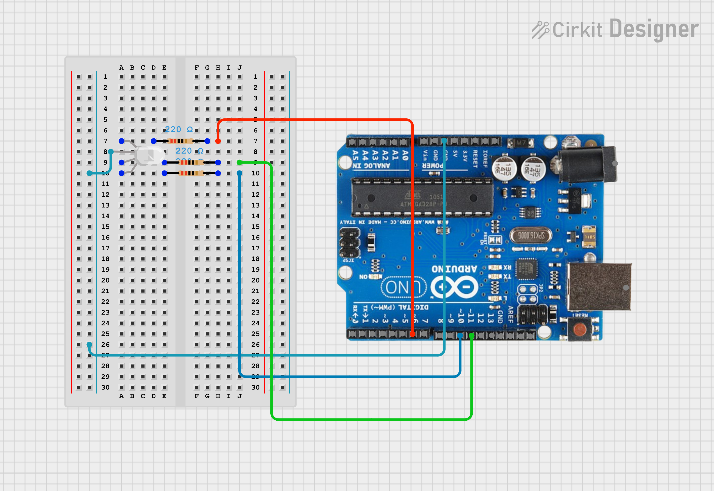

# Arduino RGB LED Control with Python GUI

This project demonstrates how to control an RGB LED connected to an Arduino board using Python's PyFirmata2 library and a custom graphical user interface (GUI) built with CustomTkinter (CTk). It allows users to control individual LEDs on/off, select custom colors using a color picker, and control LED brightness using sliders.

## Prerequisites

* **Arduino IDE:** Installed and configured.
* **Arduino Board:** Connected to your computer.
* **Python 3.x:** Installed.
* **PyFirmata2:** Install using `pip install pyfirmata2`.
* **CustomTkinter (CTk):** Install using `pip install customtkinter`.
* **CTkColorPicker:** Install using `pip install CTkColorPicker`.

## Hardware Setup

1.  Connect an RGB LED to your Arduino board using PWM-capable digital pins (specifically, pins 6, 10, and 11 as configured in the code).
2.  Connect current-limiting resistors in series with each LED pin.
3.  Connect the Arduino board to your computer via USB.

## Circuit Diagram

Here's the circuit diagram for this project:



## Software Setup

1.  **Upload StandardFirmata:**
    * Open the Arduino IDE.
    * Go to `File > Examples > Firmata > StandardFirmata`.
    * Upload the `StandardFirmata` sketch to your Arduino board.

2.  **Run the Python Script:**
    * Save the Python code (e.g., `rgb_led_control.py`) in a directory.
    * Open a terminal or command prompt.
    * Navigate to the directory where you saved the script.
    * Run the script using `python rgb_led_control.py`.

## Installation Instructions

1.  **Install Python:**
    * Ensure you have Python 3.x installed on your system.
    * If not, download it from python.org and follow the installation instructions.

2.  **Install PyFirmata2:**
    * Open a terminal or command prompt.
    * Run the following command:
        ```bash
        pip install pyfirmata2
        ```

3.  **Install CustomTkinter (CTk):**
    * In the same terminal, run:
        ```bash
        pip install customtkinter
        ```

4.  **Install CTkColorPicker:**
    * In the same terminal, run:
        ```bash
        pip install CTkColorPicker
        ```

## Code Explanation

* **PyFirmata2:** Establishes communication with the Arduino board and controls the LED pins using PWM.
* **CustomTkinter (CTk):** Creates the GUI with buttons and sliders for controlling the LEDs.
* **CTkColorPicker:** Provides a color picker dialog for selecting custom colors.
* **`hex_to_rgb(hex_code)`:** Converts hexadecimal color codes to RGB values.
* **`blue_on()`, `blue_off()`, `green_on()`, `green_off()`, `red_on()`, `red_off()`:** Functions to control individual LEDs.
* **`multi_on()`:** Function to set the RGB LED color using the color picker.
* **`all_off()`:** Function to turn off all LEDs.
* **`red_analog_value(value)`, `green_analog_value(value)`, `blue_analog_value(value)`:** Functions to control LED brightness using sliders.

## How to Use

1.  **Set Port Number:**
    * Modify the `port` variable in the script to match your Arduino's serial port (e.g., "COM3", "/dev/ttyACM0").

2.  **Run the Script:**
    * Execute the Python script.
    * A GUI window will appear.

3.  **Control LEDs:**
    * Use the "ON" and "OFF" buttons to control individual LEDs.
    * Click "SET COLOUR" to open the color picker and select a custom color.
    * Use the sliders to control the brightness of each LED.
    * Click "ALL OFF" to turn off all LEDs.

## Important Notes

* **Pin Configuration:** The code is configured to use digital pins 6 (red), 10 (blue), and 11 (green) for the RGB LED. Adjust these pins in the code if needed.
* **Serial Port:** Ensure the correct serial port is specified in the `port` variable.
* **Firmata:** Make sure you have uploaded the `StandardFirmata` sketch to your Arduino board.

## Customization

* Modify the GUI layout and appearance using CustomTkinter's widgets and options.
* Expand functionality by adding more LEDs, sensors, or other components.

## Troubleshooting

* **Serial Port Issues:** Ensure the correct serial port is selected.
* **Firmata Upload:** Verify that `StandardFirmata` is uploaded correctly.
* **Wiring:** Double-check your LED and resistor connections.
* **Library Installation:** Ensure that all necessary libraries are installed.

This project provides a foundation for controlling RGB LEDs using Python and a GUI.
